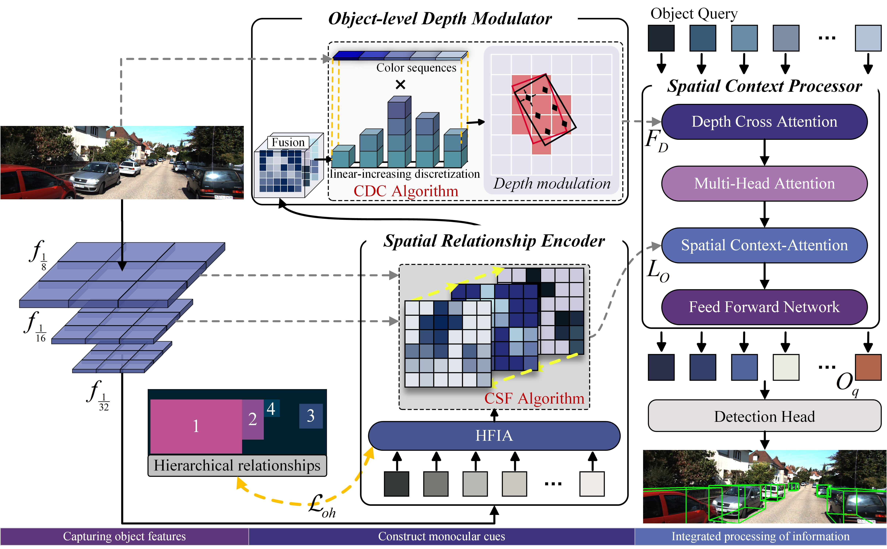
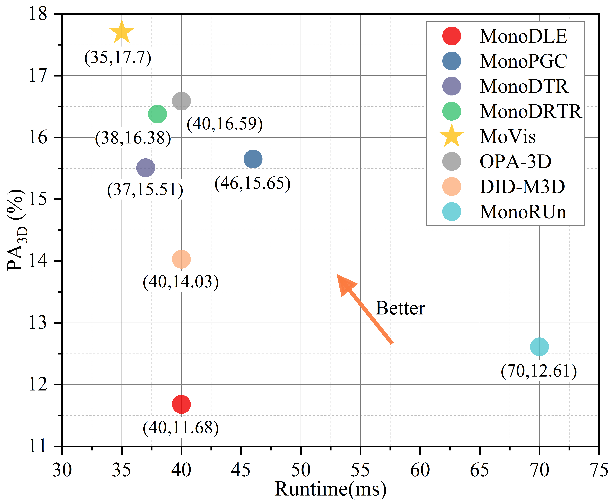

# MoVis: When 3D Object Detection is Like Human Monocular Vision

## Demo
Using KITTI tracking dataset to visualize MoVis detection results:


More demo videos can be downloaded [here](https://drive.google.com/file/d/1a45uTuUwVgAZH81JWi0q_8Cav6q7HOom/view?usp=drive_link)

## Overview



- MoVis was designed based on the way human monocular vision perceives depth information of objects. Spatial Relation Encoding (SRE) aims to decouple the interaction between features. Object-level depth modulator (ODM) obtains high-precision depth information by color sequence. The spatial Context Processor (SCP) decodes the different features.

- Extensive experiments on KITTI and Rope3D demonstrate the state of the art (**SOTA**) performance of our MoVis.

## Results



## Installation

1. Clone this project and create a conda environment:

   ```
   git clone https://github.com/KotlinWang/MoVis.git
   cd MoVis
   
   conda create -n movis python=3.8
   conda activate movis
   ```

2. Install pytorch and torchvision matching your CUDA version:

   ```
   conda install pytorch torchvision cudatoolkit
   # We adopt torch 1.9.0+cu111
   ```

3. Install requirements and compile the deformable attention:

   ```
   pip install -r requirements.txt
   
   cd lib/models/monodetr/ops/
   bash make.sh
   
   cd ../../../..
   ```

4. Make dictionary for saving training losses:

   ```
   mkdir logs
   ```

## Preparing Dataset

Download [KITTI](http://www.cvlibs.net/datasets/kitti/eval_object.php?obj_benchmark=3d) datasets and prepare the directory structure as:

```
│MonoDETR/
├──...
├──data/KITTIDataset/
│   ├──ImageSets/
│   ├──training/
│   ├──testing/
├──...
```

You can also change the data path at "dataset/root_dir" in `configs/movis.yaml`.

Download [Rope3D](http://www.cvlibs.net/datasets/kitti/eval_object.php?obj_benchmark=3d) datasets and convert it to KITTI format via [DAIR-V2X](https://github.com/destinyls/DAIR-V2X).

## Run

### Train

You can modify the settings of models and training in `configs/movis.yaml` and indicate the GPU in `train.sh`:

```
bash train.sh configs/movis.yaml movis
```

### Test

The best checkpoint will be evaluated as default. You can change it at "tester/checkpoint" in `configs/movis.yaml`:

```
bash test.sh configs/movis.yaml checkpoint_best
```

## Related Projects

Our code is based on [MonoDETR](https://github.com/ZrrSkywalker/MonoDETR) and [Deformable-DETR](https://github.com/fundamentalvision/Deformable-DETR).

## Citation

If you find this project helpful, please consider citing the following paper:
