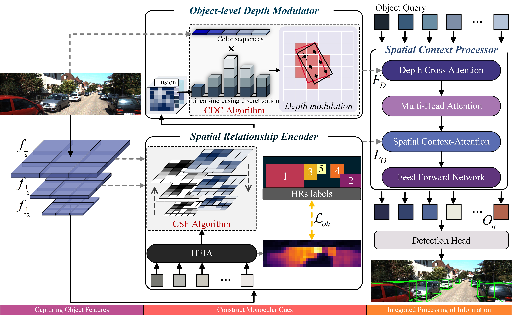
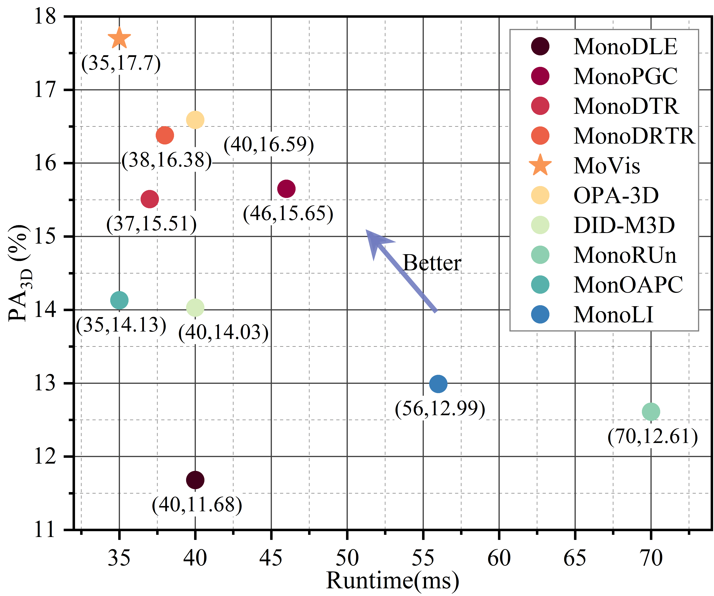

# MoVis: When 3D Object Detection is Like Human Monocular Vision

<div align="center">
   
</div>

More demo videos can be downloaded [here](https://drive.google.com/file/d/1a45uTuUwVgAZH81JWi0q_8Cav6q7HOom/view?usp=drive_link)

## :newspaper:News

- **[2025/2/20]** Our article ([*MoVis: When 3D Object Detection is Like Human Monocular Vision*](https://ieeexplore.ieee.org/document/10916602)) was successfully accepted by IEEE Transactions on Image Processing!!!  :tada: :tada: :tada: 
- **[2024/11/12]** We updated the [PyTorch 2.5.1](https://pytorch.org/) environment with the latest cuda release and uploaded the full MoVis code :rocket: .
- **[2024/9/4]** We uploaded an intermediate version of the MoVis code :smile:. 
- **[2024/3/28]** MoVis Project Creation :sunglasses:. 

## :star:Overview


- MoVis is designed based on the way human monocular vision perceives 3D objects. Spatial Relation Encoder (SRE) aims to decouple the interaction between features. Object-level depth modulator (ODM) obtains high-precision depth information by color sequence. The spatial Context Processor (SCP) decodes the different features.
- Extensive experiments on KITTI and Rope3D demonstrate the state-of-the-art performance of our MoVis.

##  :dart:Model Zoo

<table>
  <thead>
    <tr>
      <th rowspan="2">Method</th>
      <th colspan="3">AP<sub>3D|R40|IoU>0.7</sub></th>
      <th colspan="3">AP<sub>BEV|R40|IoU>0.7</sub></th>
        <th rowspan="2">Download</th>
    </tr>
    <tr>
      <th>Easy</th>
      <th>Mod.</th>
      <th>Hard</th>
      <th>Easy</th>
      <th>Mod.</th>
      <th>Hard</th>
    </tr>
  </thead>
  <tbody>
    <tr>
      <td rowspan="3">MoVis</td>
      <td>28.02</td>
      <td>20.80</td>
      <td>17.73</td>
      <td>37.56</td>
      <td>27.28</td>
      <td>23.55</td>
        <td><a href="https://drive.google.com/file/d/1QNYOtkakFXM5Mn0kZ7MptMHjBAVNf0SP/view?usp=drive_link" target="_blank">model</a> / <a href="https://drive.google.com/file/d/12FESFGb-i-Zrv2uqHgE-M9uePOxibOel/view?usp=drive_link" target="_blank">log</a></td>
    </tr>
    <tr>
      <td>28.51</td>
      <td>20.77</td>
      <td>17.65</td>
      <td>37.84</td>
      <td>27.04</td>
      <td>23.32</td>
      <td><a href="https://drive.google.com/file/d/1aXX1WAE9MWdVDsulaGkY81wXCFv21td4/view?usp=drive_link" target="_blank">model</a></td>
    </tr>
    <tr>
      <td>28.33</td>
      <td>20.75</td>
      <td>17.58</td>
      <td>37.03</td>
      <td>26.77</td>
      <td>23.01</td>
      <td><a href="https://drive.google.com/file/d/1kHmy6vDJG60zDN9b1bgXz1IRMGR1YNUW/view?usp=drive_link" target="_blank">model</a></td>
    </tr>
  </tbody>
</table>


## :see_no_evil:Results

<div align="center">
   
</div>


## :computer:Installation

<details open>

**Step 1**: Clone this project and create a conda environment:

   ```shell
   git clone https://github.com/KotlinWang/MoVis.git
   cd MoVis
   
   conda create -n movis python=3.11
   conda activate movis
   ```

**Step 2**: Install pytorch and torchvision matching your CUDA version:

   ```shell
   conda install pytorch torchvision cudatoolkit
   # We adopt torch 2.5.1+cu121
   ```

**Step 3**: Install requirements and compile the deformable attention:

   ```shell
   pip install -r requirements.txt
   
   cd lib/models/movis/ops/
   bash make.sh
   
   cd ../../../..
   ```

**Step 4**: Make dictionary for saving training losses:

   ```shell
   mkdir logs
   ```
</details>

## :satellite:Preparing Dataset

<details open>

Download [KITTI](http://www.cvlibs.net/datasets/kitti/eval_object.php?obj_benchmark=3d) datasets and prepare the directory structure as:

```
│MonoDETR/
├──...
├──data/KITTIDataset/
│   ├──ImageSets/
│   ├──training/
│   ├──testing/
├──...
```

You can also change the data path at "dataset/root_dir" in `configs/movis.yaml`.

Download [Rope3D](http://www.cvlibs.net/datasets/kitti/eval_object.php?obj_benchmark=3d) datasets and convert it to KITTI format via [DAIR-V2X](https://github.com/destinyls/DAIR-V2X).

</details>

## :running: Run

### Train

You can modify the settings of models and training in `configs/movis.yaml` and indicate the GPU in `train.sh`:

```shell
bash train.sh configs/movis.yaml movis
```

### Test

The best checkpoint will be evaluated as default. You can change it at "tester/checkpoint" in `configs/movis.yaml`:

```shell
bash test.sh configs/movis.yaml checkpoint_best
```

## :mag: Related Projects

Our code is based on [MonoDETR](https://github.com/ZrrSkywalker/MonoDETR) and [RT-DETR](https://github.com/lyuwenyu/RT-DETR).

## Citation

If you find this project useful in your research, please consider citing：

```
@ARTICLE{10916602,
  author={Wang, Zijie and Yi, Jizheng and Chen, Aibin and Han, Guangjie},
  journal={IEEE Transactions on Image Processing}, 
  title={MoVis: When 3D Object Detection Is Like Human Monocular Vision}, 
  year={2025},
  volume={34},
  number={},
  pages={3025-3040},
  keywords={Three-dimensional displays;Object detection;Image color analysis;Depth measurement;Feature extraction;Transformers;Training;Modulation;Detectors;Data mining;3D object detection;monocular image;human monocular vision;autonomous driving},
  doi={10.1109/TIP.2025.3544880}}
```

